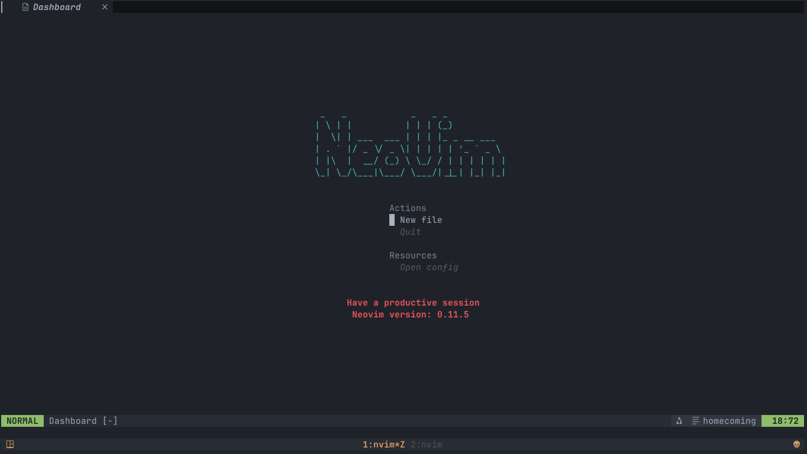
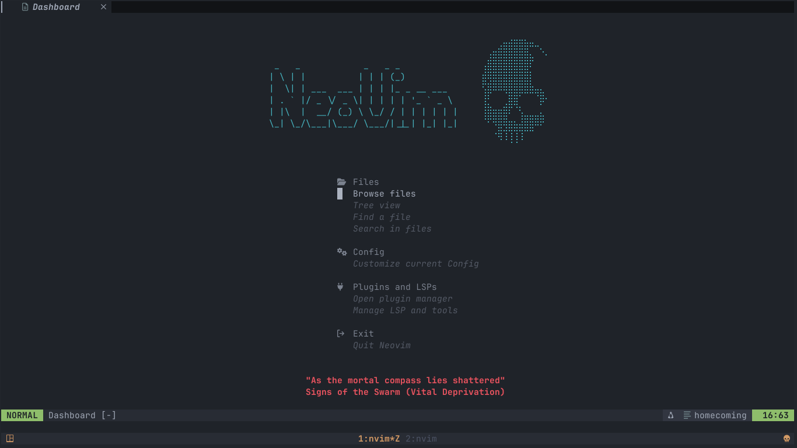
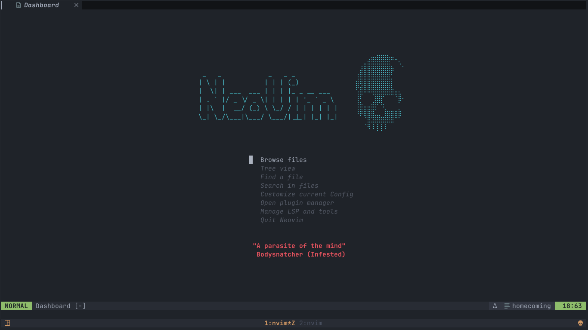

# homecoming.nvim

A dead-simple, customizable and cozy dashboard.

## Motivation

I always felt that the startup experience could be more welcoming and useful. Most dashboard plugins I tried were either packed with features I didn’t need or required confusing or overwhelming configuration just to look decent. I wanted something that felt right out of the box—clean, simple, and easy to tweak. That’s why I built this plugin: to give myself (and others) a place that makes starting up Neovim feel inviting and hassle-free... evoking the feeling of **coming home** to a familiar and cozy environment every time I open my editor.

## Preview

Default configuration with a simple header, two sections (Actions and Resources), and a footer showing a welcome message and the Neovim version:



Custom configuration with a custom header, sections and footer:



Custom configuration with a custom header, sections with no title or gaps and footer:



## Features

- **No configuration required to get started**
- Easy setup and configuration
- Customizable dashboard sections
- No dependencies

## Installation

### Using [vim-plug](https://github.com/junegunn/vim-plug):

```vim
Plug 'leo-alvarenga/homecoming.nvim'
```

### Using [lazy.nvim](https://github.com/folke/lazy.nvim):

```lua
{
  'leo-alvarenga/homecoming.nvim',
  branch = 'nightly', -- Optional: specify the nightly branch if you want to use the latest features
  opts = {}, -- No configuration is required to get started
}
```

## Usage

After installation, the dashboard will appear automatically when you start Neovim with no files specified if `opts.auto_start` is set to `true` or left unset.

You can also manually open the dashboard at any time by running the `:Homecoming` command.

### Commands

- `:Homecoming` - Open the dashboard; if the dashboard is already open, it will simply be rerendered, so it can be used to quickly refresh the dashboard content
- `:HomecomingCloseCurrBuf` - Close the current buffer and open the dashboard if it was the last buffer; Closing the dashboard will simply rerender it, so it can also be used to quickly refresh the dashboard content
- `:HomecomingOpenAndPreserveOther` - Open the dashboard, without closing other buffers

Creating a custom mapping to close the current buffer with `:HomecomingCloseCurrBuf` can be useful to ensure that the dashboard will open when closing the last buffer, for example:

```vim
nnoremap <leader>q :HomecomingCloseCurrBuf<CR>
```

Or using Lua:

```lua
vim.api.nvim_set_keymap("n", "<leader>q", ":HomecomingCloseCurrBuf<CR>", { noremap = true, silent = true })
```

### Configuration

You can customize the dashboard in your `init.lua` or `init.vim`:

```lua
require('homecoming-nvim').setup({
  -- Example options
  header = "Welcome to Neovim!",
})
```

You can find a complete, functional, and visually appealing example in the [`./plugin/example_lazy.lua`](./plugin/example_lazy.lua) file.

This is the default configuration, with all available options:

```lua
-- See types below for detailed documentation on each option

--- @type homecoming-nvim.Opts
local opts = {
	auto_start = true,

	header_hl_group = "Title",
	header_mb = 1,
	header = function()
		return {
			"Welcome",
		}
	end,

	item_gap = 0,
	item_hl_group = "Comment",
	item_selected_hl_group = "Normal",
	item_indent = 2,
	item_prefix_char = "",

	section_anchor = "header",
	section_gap = 1,
	section_hl_group = "Delimiter",
	sections = {
		{
			title = "Actions",
			items = {
				{
					label = "New file",
					action = function()
						vim.cmd("enew")
					end,
				},
				{
					label = "Quit",
					action = function()
						vim.cmd("qa")
					end,
				},
			},
		},
		{
			title = "Resources",
			items = {
				{
					label = "Open config",
					action = function()
						vim.cmd("edit " .. vim.fn.stdpath("config") .. "/init.lua")
					end,
				},
			},
		},
	},

	footer_anchor = "self",
	footer_hl_group = "ErrorMsg",
	footer_mt = 2,
	footer_mb = 0,
	footer = function()
		return {
			"Have a productive session",
			"Neovim version: " .. vim.version().major .. "." .. vim.version().minor .. "." .. vim.version().patch,
		}
	end,
}
```

## Options Reference

| Field                  | Type                           | Description                                                                                                                                                    | Default                                                                 |
| ---------------------- | ------------------------------ | -------------------------------------------------------------------------------------------------------------------------------------------------------------- | ----------------------------------------------------------------------- |
| auto_start             | boolean?                       | If true, the dashboard will automatically open when Neovim starts with no file arguments.                                                                      | `true`                                                                  |
| header_hl_group        | string?                        | The name of the highlight group to be used for the header section.                                                                                             | `"Title"`                                                               |
| header_centered        | boolean?                       | Whether to center the header text. If true, all text is aligned at the center, potentially breaking headers that contain multiple lines with diffents lengths. | `true`                                                                  |
| header_mb              | integer?                       | How many lines should be added as margin after the header section.                                                                                             | `2`                                                                     |
| header                 | string\|string[]\|function     | A function that returns a list of strings to be displayed as the dashboard header.                                                                             | `string[]`, See the [preview section](#preview) to see the actual value |
| section_anchor         | homecoming-nvim.ContentAnchor? | Determines which component to use as the anchor for centering when the centered option is enabled.                                                             | `"self"`                                                                |
| section_hl_group       | string?                        | The name of the highlight group to be used for section titles.                                                                                                 | `"Delimiter"`                                                           |
| section_gap            | integer?                       | How many lines should be added as gap between sections.                                                                                                        | `1`                                                                     |
| sections               | homecoming-nvim.Section[]      | A list of sections to be displayed on the dashboard, each with a title and a list of items.                                                                    |                                                                         |
| item_gap               | integer?                       | How many lines should be added as gap between items.                                                                                                           | `0`                                                                     |
| item_hl_group          | string?                        | The name of the highlight group to be used for items.                                                                                                          | `"Comment"`                                                             |
| item_selected_hl_group | string?                        | The name of the highlight group to be used of the currently selected item.                                                                                     | `"Normal"`                                                              |
| item_prefix_char       | string?                        | A string to prefix each item label with.                                                                                                                       | `""`                                                                    |
| item_indent            | integer?                       | How many spaces to indent each item label (including the len of item_prefix_char).                                                                             | `2`                                                                     |
| footer_anchor          | homecoming-nvim.ContentAnchor? | Determines which component to use as the anchor for centering when the centered option is enabled.                                                             | `"self"`                                                                |
| footer_hl_group        | string?                        | The name of the highlight group to be used for the footer.                                                                                                     | `"ErrorMsg"`                                                            |
| footer_mt              | integer?                       | How many lines should be added as margin before the footer section.                                                                                            | `2`                                                                     |
| footer_mb              | integer?                       | How many lines should be added as margin after the footer section.                                                                                             | `0`                                                                     |
| footer                 | string\|string[]\|function     | A function that returns a list of strings to be displayed as the dashboard footer.                                                                             |                                                                         |

### Types

Below are the types used in the options for better understanding and reference when configuring the dashboard. Requiring the `homecoming-nvim.types` module will make these types available in your configuration files for type checking and autocompletion.

```lua
--- @class homecoming-nvim.Item
--- @field label string The text to be displayed for the item in the dashboard
--- @field action string|function? The VimCMD or function to be executed when the item is selected

--- @class homecoming-nvim.Section
--- @field title string? The title of the section, displayed above the list of items
--- @field items homecoming-nvim.Item[] A list of items in the section, each with a label and an action function to execute when selected

--- @alias homecoming-nvim.ContentAnchor
--- | 'header'
--- | 'header_half'
--- | 'self'

--- @class homecoming-nvim.Opts
--- @field auto_start boolean? If true, the dashboard will automatically open when Neovim starts with no file arguments. Default is true
--- @field header_hl_group string? The name of the highlight group to be used for the header section. Default is "Title"
--- @field header_centered boolean? Whether to center the header text. If true, all text is aligned at the center, potentially breaking headers that contain multiple lines with diffents lengths. Default is true
--- @field header_mb integer? How many lines should be added as margin after the header section. Default is 2
--- @field header string|string[]|(fun(): string[]|string) A function that returns a list of strings to be displayed as the dashboard header
--- @field section_anchor homecoming-nvim.ContentAnchor? Determines which component to use as the anchor for centering when the centered option is enabled. If 'header', the header will be used as the anchor for centering. If 'self' or not specified, the longest line among header, section titles, and item labels will be used as the anchor for centering. Default is 'self'
--- @field section_hl_group string? The name of the highlight group to be used for section titles. Default is "Delimiter"
--- @field section_gap integer? How many lines should be added as gap between sections. Default is 1
--- @field sections homecoming-nvim.Section[] A list of sections to be displayed on the dashboard, each with a title and a list of items
--- @field item_gap integer? How many lines should be added as gap between items. Default is 0
--- @field item_hl_group string? The name of the highlight group to be used for items. Default is "Comment"
--- @field item_selected_hl_group string? The name of the highlight group to be used of the currently selected item. Default is "Normal"
--- @field item_prefix_char string? A string to prefix each item label with, default is ""
--- @field item_indent integer? How many spaces to indent each item label (including the len of item_prefix_char), default is 2
--- @field footer_anchor homecoming-nvim.ContentAnchor? Determines which component to use as the anchor for centering when the centered option is enabled. If 'header', the header will be used as the anchor for centering. If 'self' or not specified, the longest line among header, section titles, and item labels will be used as the anchor for centering. Default is 'self'
--- @field footer_hl_group string? The name of the highlight group to be used for the footer. Default is "ErrorMsg"
--- @field footer_mt integer? How many lines should be added as margin before the footer section. Default is 2
--- @field footer_mb integer? How many lines should be added as margin after the footer section. Default is 0
--- @field footer string|string[]|(fun(): string[]|string) A function that returns a list of strings to be displayed as the dashboard footer
```

## License

This project is licensed under the GPLv3 License. See the [LICENSE](LICENSE) file for details.
